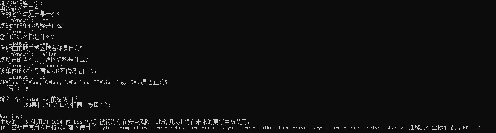
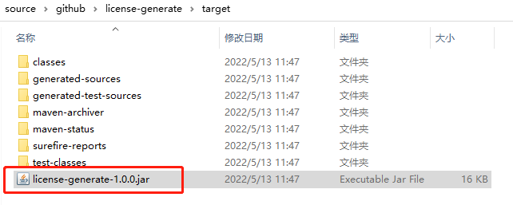
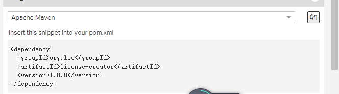

## license-generate

#### 介绍

    使用TrueLicense 生成和验证License（服务器许可）

### 二、原理

    首先需要生成密钥对，方法有很多，JDK中提供的KeyTool即可生成。  
    授权者保留私钥，使用私钥对包含授权信息（如截止日期，MAC地址等）的license进行数字签名。 
    公钥交给使用者（放在验证的代码中使用），用于验证license是否符合使用条件。

### 三、使用Keytool命令生成密钥对

> Keytool 是一个Java 数据证书的管理工具 ,Keytool 将密钥（key）和证书（certificates）存在一个称为keystore的文件中 在keystore里，包含两种数据： 密钥实体（Key entity）——密钥（secret key）又或者是私钥和配对公钥（采用非对称加密） 可信任的证书实体（trusted certificate entries）——只包含公钥

### 四、生成密钥的流程

#### 1、首先要用KeyTool工具来生成私匙库：（-alias别名 –validity 3650表示10年有效）

> keytool -genkey -alias privatekey -keystore privateKeys.store -validity 3650 -keysize 1024

注意！！！默认的密码策略是6未数字与字母，如果不遵守会报错，我这里使用123456q；要使用1024长度的密钥，否则在使用truelicense的时候会报错

#### 2、然后把私匙库内的证书导出到一个文件当中

> keytool -export -alias privatekey -file certfile.cer -keystore privateKeys.store

    会得到一个certfile.cer，此证书是为了给使用方创建公钥证书，再生产公钥后此证书就没有用了。

#### 3、然后再把这个证书文件导入到公匙库

> keytool -import -alias publiccert -file certfile.cer -keystore publicCerts.store

    公钥的密码设置为了lee2205,获取到公钥库，publicCerts.store

> privateKeys.keystore：私钥，这个我们自己留着，不能泄露给别人。 
> publicCerts.keystore：公钥，这个给客户用的。在我们程序里面就是用他配合license进行授权信息的校验的。 
> certfile.cer：这个文件没啥用，可以删掉。

### 五、生成许可文件

    首先修改 LicenseCreator 中的 DEFAULT_HOLDER_AND_ISSUER，
    当然如果你使用我提供的私钥就不用修改，如果不是请根据你自己生成的秘钥，生成参数，传入。
    CreatorTest 测试包中的类
    修改许可证书保存的路径；私钥库所在地址；
    修改holderAndIssuer，根据你自己生成私钥库的时候填写的内容。
    可以修改授权时间 Calendar.MONTH-月|Calendar.DAY-日|Calendar.YEAR-年

> // 证书存储地址 
> param.setLicensePath("E:\\license.lic"); 
> // 私钥库所在地址 
> param.setPrivateKeysStorePath("F:\\source\\gitee\\license-creator\\src\\main\\resources\\privateKeys.store"); 
> X500Principal holderAndIssuer = new X500Principal("CN=Lee, OU=Lee, O=Lee, L=Dalian, ST=Liaoning, C=zn"); 
> // 授权3个月时间 
> expiryCalendar.add(Calendar.MONTH, 3); 

    执行 GenTest.generateLicense() 方法，能够生成许可文件。

    可以看到在E盘中已经生成了许可文件

### 六、将生成的许可文件及公钥配置给需要使用的文件

    此处使用springboot项目进行集成

首先需要将此工程打包后，传入maven私库或者导入项目，我这里上传到私库。

需要注意的事项： 发现是在通过keytool生成密钥对的时候，公、私钥库的密码不一样（与私钥密码无关），设置为一样的以后，就可以了。